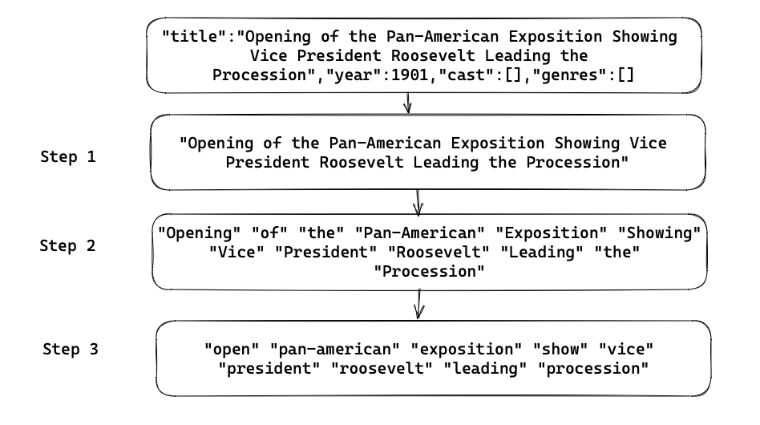

# dbul 🎯

This is a library that plays on the name double bullseye (shortened to d-bull) for the center point of a dartboard. Given the library is written in [dart](https://dart.dev) and aims to have the best score when doing a full text search engine (FTS).


## Indexing

We are aiming to look up matches using an index of the documents. As shown in one of earliest examples from Wikipedia (Novus Atlas Sinensis), text is used to refer to the page it came from. 


[original source](https://upload.wikimedia.org/wikipedia/commons/1/19/Novus_Atlas_Sinensis_-_First_page_of_the_index.jpg)

We refer to this as an inverted index noting the definition from the [wikipedia page](https://en.wikipedia.org/wiki/Inverted_index)
```
In computer science, an inverted index (also referred to as a postings list, postings file, or inverted file) is a database index storing a mapping from content, such as words or numbers, to its locations in a table, or in a document or a set of documents
```

### Steps to create inverted index

To produce this inverted index. We will take the following steps:

1. Retrieve the text for the field to analyse
2. Take the input text and convert this to a list of *tokens* ie. tokenize the text
3. Filter/Transform the tokens to find a balance between matching too many documents and too few. Examples filters include lowercasing, removing stop words, stemming or using ngrams. 


[source](https://excalidraw.com/#room=be8954417edfe0a339dd,wKbRnI_bXvSQfqsvsIm7jQ)


The resulting index will look similar to the following assuming the example above was id 3 and there are other similar docs matching the tokens:

```json 
[
    "open": [ 3, 4, 12],
    "president": [12 ,3 ],
    "procession": [ 3, 4 5],
    ...
]
```

## Tokenization

... Todo 


## Inspriation

[Building a full-text search engine in 150 lines of Python code](https://bart.degoe.de/building-a-full-text-search-engine-150-lines-of-code/)
[Lunrjs.com](https://lunrjs.com)